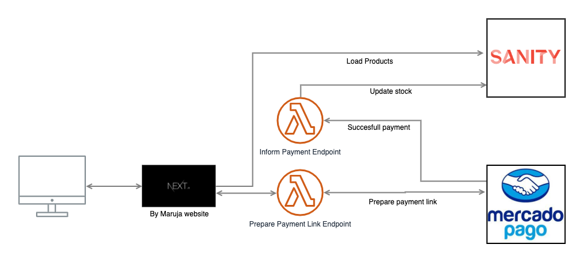

# By Maruja e-commerce

This project is an e-commerce built for `by maruja`.

## Tech Stack

- Next.js
- TypeScript
- Jest
- Enzyme
- Sanity
- Vercel

## Requirements

1. install node and npm
2. git clone the repository
3. install [Prettier Visual Studio Code Extension](https://prettier.io/)
4. install [EsLint Visual Studio Code Extension](https://marketplace.visualstudio.com/items?itemName=dbaeumer.vscode-eslint)
5. npm install each project

## Getting Started

/Web is the application
/Studio is Sanity Studio

## Architecture

